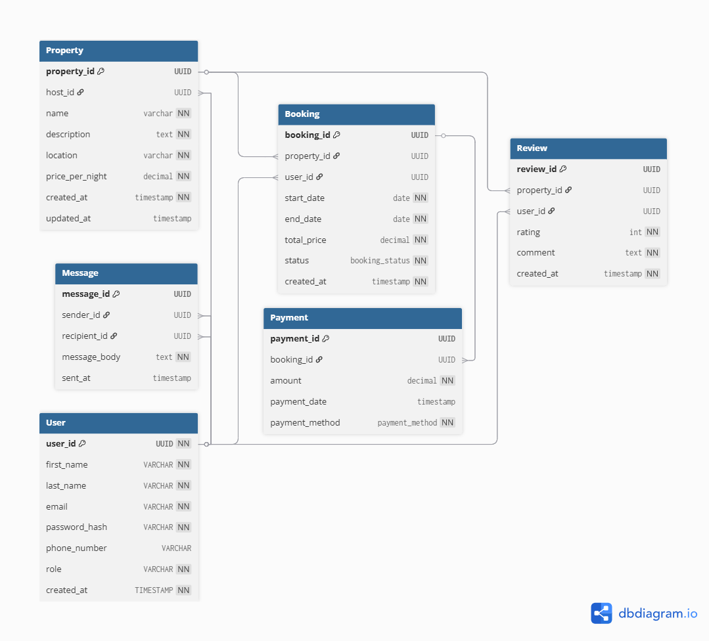

📦 Database Documentation: Property Booking System

## Entity Relationship Diagram (ERD)

*This diagram shows the complete database structure and relationships between all entities in the Airbnb clone system.*
🔹 User
Stores information about users in the system, including hosts and guests.

Column	Type	Constraints	Description
user_id	UUID	PK, NOT NULL	Unique identifier for the user
first_name	VARCHAR	NOT NULL	User's first name
last_name	VARCHAR	NOT NULL	User's last name
email	VARCHAR	UNIQUE, NOT NULL	User's email address
password_hash	VARCHAR	NOT NULL	Hashed password
phone_number	VARCHAR	NULL	Phone number (optional)
role	VARCHAR	NOT NULL	User role (e.g., guest, host)
created_at	TIMESTAMP	NOT NULL	Account creation timestamp

🏠 Property
Represents a rentable property listed by a host.

Column	Type	Constraints	Description
property_id	UUID	PK, NOT NULL	Unique property ID
host_id	UUID	FK → User(user_id)	Host who owns the property
name	VARCHAR	NOT NULL	Property name
description	TEXT	NOT NULL	Detailed description of the property
location	VARCHAR	NOT NULL	Location of the property
price_per_night	DECIMAL	NOT NULL	Cost per night
created_at	TIMESTAMP	NOT NULL	Date listed
updated_at	TIMESTAMP	NULL	Last update timestamp

📅 Booking
Tracks bookings made by users for a property.

Column	Type	Constraints	Description
booking_id	UUID	PK, NOT NULL	Booking identifier
property_id	UUID	FK → Property	Property being booked
user_id	UUID	FK → User	User who made the booking
start_date	DATE	NOT NULL	Start date of the booking
end_date	DATE	NOT NULL	End date of the booking
total_price	DECIMAL	NOT NULL	Total cost of the booking
status	booking_status	NOT NULL	Status (e.g., pending, confirmed)
created_at	TIMESTAMP	NOT NULL	Booking creation timestamp

💳 Payment
Handles payment records associated with bookings.

Column	Type	Constraints	Description
payment_id	UUID	PK, NOT NULL	Unique payment ID
booking_id	UUID	FK → Booking	Booking being paid for
amount	DECIMAL	NOT NULL	Payment amount
payment_date	TIMESTAMP	NOT NULL	Date of payment
payment_method	payment_method	NOT NULL	Payment method used (e.g., card)

📝 Review
Contains user reviews on properties.

Column	Type	Constraints	Description
review_id	UUID	PK, NOT NULL	Unique review ID
property_id	UUID	FK → Property	Reviewed property
user_id	UUID	FK → User	Reviewer
rating	INT	NOT NULL	Numeric rating (e.g., 1–5 stars)
comment	TEXT	NULL	Optional text feedback
created_at	TIMESTAMP	NOT NULL	Review timestamp

💬 Message
Supports private messaging between users.

Column	Type	Constraints	Description
message_id	UUID	PK, NOT NULL	Unique message ID
sender_id	UUID	FK → User	Sender of the message
recipient_id	UUID	FK → User	Recipient of the message
message_body	TEXT	NOT NULL	Message content
sent_at	TIMESTAMP	NOT NULL	Time message was sent

🔗 Relationships Overview
A User can host many Properties

A User can book many Properties

A Property can have many Bookings, Reviews

A Booking has one Payment

Users can send and receive many Messages

